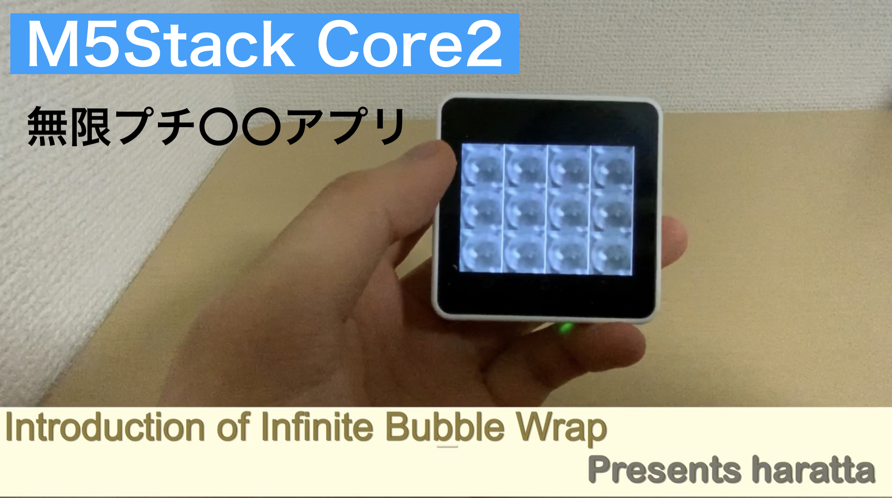
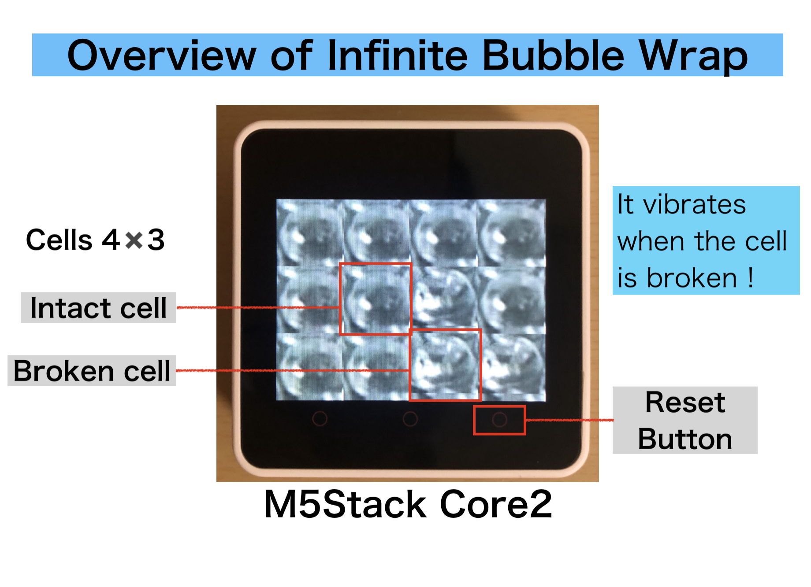
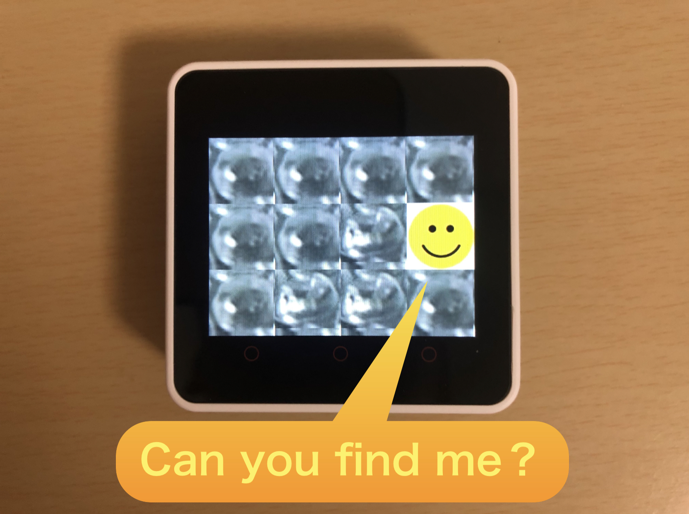

M5Stack Core2 Infinite Bubble Wrap
===

M5Stack_Core2向けアプリ Infinite Bubble Wrap (無限プチ○○)です。

I made an application that makes the best use of M5Stack_Core2. It`s called Infinite Bubble Wrap.

## Overview
M5Stack_Core2のタッチスクリーンとバイブレーション機能を活かして、無限プチ○○アプリを作りました。バブルラップとは梱包材に使われるアレです。バブルラップのセルを無限に割ることができます。

I made an infinite bubble wrap by taking advantage of the touch screen and vibration function of M5Stack_Core2.Bubble Wrap is a material used for packing materials. You can divide the bubble wrap cells infinitely.

バブルラップを割る触感を無限にお楽しみいただけます!!

You can enjoy the tactile sensation of the cracking bubble wrap endlessly!!

## Features

画面には4x3のセルが表示され、一定時間触るとセルが割れます。(振動feedback付)

4x3 cells are displayed on the screen, and if you touch them for a period of time, the cells will crack. (With vibration feedback)

全てのセルが割れてしまったら、右下のボタンを触ると、全てのセルが元通りに復活します。

If all the cells are broken, touch the button at the bottom right to restore all tes cells.

セルをつぶした際に、ごく稀に当たり画像が表示されます。

When you crush a cell, a hit image is displayed very rarely.

## Caution !!
このプログラムは数日で作られました。拙いコードでよければ参考にしてください。

This program was created in a few days. If you don`t mind the dirty code, please refer to it.

## Licence
[MIT](https://github.com/haratta27/M5core2_InfiniteBubbleWrap/LICENSE)
## Author
[haratta27](https://twitter.com/harattaMouse)
